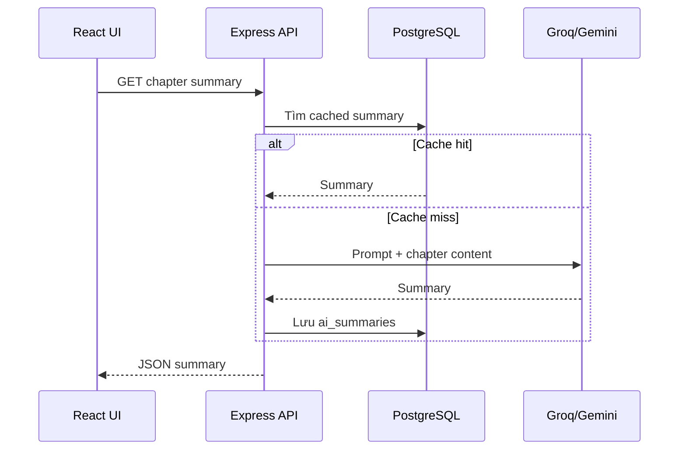

# Tính năng AI của CMC Truyện

> Trạng thái: đã triển khai nền tảng. Tài liệu này mô tả phạm vi hiện tại và hướng phát triển tiếp theo.

## Mục tiêu

AI trong CMC Truyện hỗ trợ độc giả hiểu và khám phá nội dung nhanh hơn, không thay thế tác giả, Moderator hoặc quyết định quản trị.

## Tính năng hiện có

### Tóm tắt chương

- Đầu vào: nội dung chương đã lưu trên backend.
- Đầu ra: tóm tắt ngắn bằng tiếng Việt.
- API: `GET /api/chapters/:id/summary`.
- Cache: RAM theo nội dung và bảng `ai_summaries` theo chapter.
- UI: `AIChapterSummary.jsx` có skeleton, copy và regenerate khi được phép.

### Gợi ý truyện cá nhân hóa

- API: `GET /api/ai/recommendations`.
- Tín hiệu: lịch sử đọc, thời gian đọc, completion, follow và metadata/tag truyện.
- Kết quả được đối chiếu với dữ liệu truyện hiện có trước khi trả frontend.
- Không áp dụng cho Guest vì không có user history đáng tin cậy.

## Nhà cung cấp và fallback

```text
Request backend
  ├─ Groq / llama-3.1-8b-instant (ưu tiên)
  ├─ Google Gemini (fallback)
  └─ lỗi có kiểm soát nếu không nhà cung cấp nào khả dụng
```

- Timeout request AI: 30 giây.
- API key chỉ đặt trong `backend/.env`.
- Frontend không được gọi trực tiếp Groq/Gemini.
- Không ghi prompt chứa secret, token hoặc dữ liệu cá nhân vào log.

## Nguyên tắc sản phẩm

1. Người dùng chủ động yêu cầu tóm tắt; không gửi toàn bộ thư viện sang AI nền.
2. Hiển thị rõ nội dung do AI tạo và có thể sai.
3. Không dùng AI để tự động khóa tài khoản hoặc duyệt/từ chối truyện mà không có rule/human review.
4. Ưu tiên cache để giảm latency, chi phí và dữ liệu gửi ra ngoài.
5. Khi AI lỗi, trải nghiệm đọc truyện chính vẫn hoạt động.

## Luồng tóm tắt



## Chỉ số đánh giá

- P50/P95 latency cho cache hit và cache miss.
- Tỷ lệ cache hit.
- Tỷ lệ request AI lỗi/timeout/fallback.
- Tỷ lệ người dùng mở tóm tắt và tiếp tục đọc.
- CTR và completion rate của truyện được gợi ý.
- Chi phí AI trên mỗi người dùng hoạt động.

## Hướng phát triển

| Ưu tiên | Hạng mục | Điều kiện |
|---|---|---|
| P0 | Quan sát latency, error và fallback | Không log nội dung nhạy cảm |
| P0 | Rate limit riêng cho AI | Theo user và endpoint |
| P1 | Cache Redis dùng chung nhiều instance | Có TTL và version prompt |
| P1 | Feedback “hữu ích/không hữu ích” | Dùng để đánh giá, không tự fine-tune |
| P2 | Tóm tắt theo mạch nhiều chương | Phải giới hạn context và chi phí |
| P2 | Giải thích lý do đề xuất | Không tiết lộ dữ liệu người dùng khác |

## Ngoài phạm vi hiện tại

- Sinh hoặc viết lại chương thay tác giả.
- Huấn luyện model bằng nội dung người dùng tải lên.
- Auto moderation hoàn toàn dựa trên LLM.
- Gửi password, token, email hoặc dữ liệu private vào prompt.

Chi tiết kỹ thuật nằm tại [AI_PERSONALIZATION](../technical/AI_PERSONALIZATION.md) và quy tắc sử dụng tại [AI_USAGE_POLICY](../technical/AI_USAGE_POLICY.md).
