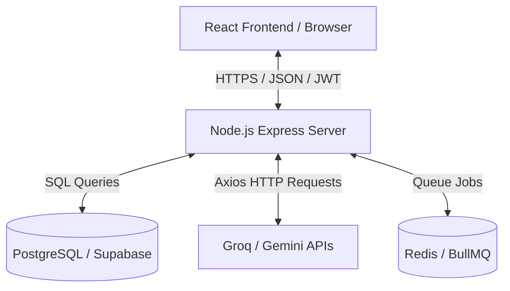
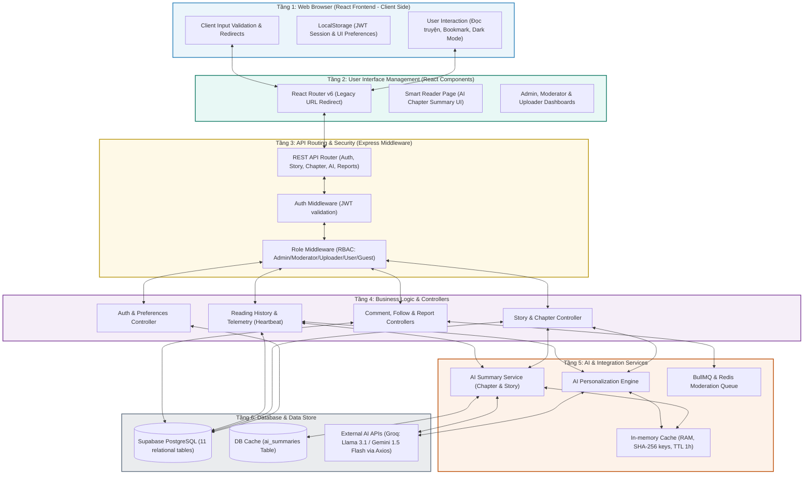
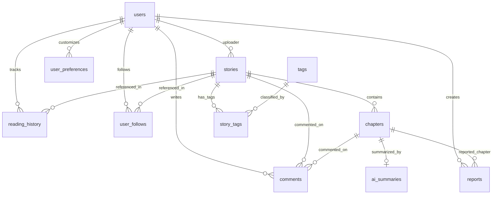

# Tài Liệu Kiến Trúc CMC Truyện (ARCHITECTURE.md)

Tài liệu này đặc tả chi tiết kiến trúc hệ thống, thiết kế cơ sở dữ liệu và cơ chế định tuyến (bao gồm việc chuyển hướng từ phiên bản trang cũ sang React).

---

## 🗺️ 1. Tổng Quan Kiến Trúc (System Architecture)

CMC Truyện được xây dựng theo mô hình **Tách biệt hoàn toàn (Decoupled Frontend-Backend)**. Giao tiếp giữa hai bên thông qua giao thức **RESTful API** sử dụng định dạng dữ liệu **JSON**.

### Kiến Trúc Phân Tầng Toàn Diện (End-to-End Layered Architecture)
Để tách biệt trách nhiệm và tăng tính bảo trì cho toàn bộ dự án, hệ thống được thiết lập theo mô hình **kiến trúc phân tầng 6 lớp** trải dài từ phía Client (React Frontend) cho tới phía Server (Node/Express) và Database:
1.  **Browser Layer (Lớp 1 - Client Side):** Tương tác người dùng, lưu cấu hình Dark Mode/cỡ chữ và session token JWT ở LocalStorage.
2.  **UI Management Layer (Lớp 2 - React Components):** React Router định tuyến động, quản lý cấu trúc component giao diện và dashboards.
3.  **API Routing & Security Layer (Lớp 3 - Express Middleware):** Tiếp nhận HTTP request ở server, xử lý giải mã xác thực Token JWT và phân quyền vai trò (RBAC).
4.  **Business Logic Layer (Lớp 4 - Controllers):** Các controller điều hướng luồng nghiệp vụ chính và thu thập dữ liệu heartbeat đọc truyện.
5.  **AI & Integration Services Layer (Lớp 5 - Services):** Tầng trung gian kết nối bên thứ ba (AI APIs) và đẩy bình luận vào hàng đợi xử lý nền BullMQ.
6.  **Database & Data Store Layer (Lớp 6 - Models & DB):** Connection pool pg truy vấn SQL trực tiếp tương tác với PostgreSQL database vật lý.

---

## 🗄️ 2. Thiết Kế Cơ Sở Dữ Liệu (Database Schema)

Cơ sở dữ liệu của hệ thống gồm **11 bảng** quan hệ chặt chẽ với nhau, được host trên Supabase (PostgreSQL):

### Các bảng chi tiết:
1.  **`users`**: Thông tin tài khoản người dùng và vai trò phân quyền (`role`: Admin, Moderator, Uploader, User, Guest), trạng thái kích hoạt (`is_active`).
2.  **`stories`**: Thông tin các bộ truyện (tên, tác giả, uploader, mô tả, thể loại, trạng thái, ẩn bởi admin `hidden_by_admin`).
3.  **`chapters`**: Các chương truyện thuộc bộ truyện tương ứng.
4.  **`reading_history`**: Lịch sử đọc của người dùng, gồm chương đọc cuối cùng, thời gian đọc và tỷ lệ hoàn thành.
5.  **`user_follows`**: Danh sách các bộ truyện đang theo dõi.
6.  **`comments`**: Bình luận của người dùng trên truyện/chương (chứa trạng thái kiểm duyệt `status`).
7.  **`user_preferences`**: Tùy chỉnh cá nhân (cỡ chữ, giãn dòng, giao diện dark mode).
8.  **`ai_summaries`**: Cache tóm tắt của chương truyện do AI sinh ra.
9.  **`reports`**: Báo cáo vi phạm nội dung chương truyện gửi lên Admin/Moderator.
10. **`tags`**: Thẻ từ khóa phân loại truyện.
11. **`story_tags`**: Liên kết N-N giữa truyện và thẻ từ khóa.
12. **`bad_words`**: Danh sách từ khóa nhạy cảm bị cấm/lọc tự động (mức độ tier 1, 2, 3).

---

## 🔀 3. Định Tuyến & Điều Hướng (Routing & Legacy URL Migration)

Để đảm bảo các liên kết cũ từ trang HTML tĩnh cũ không bị lỗi (404) khi nâng cấp lên React, hệ thống triển khai cơ chế điều hướng 2 lớp:

### Lớp 1: File HTML Redirect Tĩnh (`frontend/public/pages/*.html`)
Khi deploy cùng một domain, các file HTML cũ tại thư mục `pages/` trước đây được giả lập bằng các file redirect tĩnh nằm trong thư mục `public/pages/` của React. Các file này chứa script để đọc tham số URL và chuyển hướng sang Router của React.

### Lớp 2: Thành phần `LegacyRedirect.jsx` trong React Router
Thành phần này đón nhận các yêu cầu truy cập từ URL cũ và thực hiện ánh xạ sang URL mới.

#### Bảng ánh xạ URL cũ sang URL mới:

| URL Cũ (Legacy HTML) | URL Mới (React Router) |
|---|---|
| `/pages/story.html` | `/browse` |
| `/pages/story.html?genre=...` | `/browse?category=...` |
| `/pages/reader.html?storyId=1&chapterId=2` | `/story/1/chapter/2` |
| `/pages/profile.html` | `/profile` |
| `/pages/account.html` | `/account` |
| `/pages/admin.html` | `/admin` |

---

## 🛡️ 4. Xác Thực & Phân Quyền (Authentication & Middleware)

*   **Xác thực (Authentication):** Sử dụng token JWT (được lưu tại `localStorage` phía Client). Khi client thực hiện API request, token được tự động đính kèm vào header `Authorization: Bearer <token>`.
*   **Tầng Middleware ở Backend:**
    *   `authMiddleware.js`: Giải mã JWT token để xác nhận danh tính người dùng. Nếu token không hợp lệ hoặc hết hạn, trả về mã lỗi `401 Unauthorized`.
    *   `roleMiddleware.js`: Kiểm tra vai trò của người dùng (`role`) đối với các endpoint bảo mật. Ví dụ: Endpoint thêm truyện mới (`POST /api/stories`) chỉ cho phép role là `Uploader` hoặc `Admin` truy cập.

---

## 📬 5. Xử Lý Hàng Đợi Nền & Kiểm Duyệt Bình Luận (BullMQ + Redis)

Hệ thống triển khai hàng đợi kiểm duyệt tự động để đảm bảo môi trường thảo luận sạch:
*   **Hàng đợi (`moderationQueue`):** Khi người dùng gửi bình luận mới, nội dung được chuyển tiếp vào hàng đợi BullMQ chạy ngầm trên nền Redis.
*   **Worker (`moderationWorker`):** Nhận job từ hàng đợi và tự động kiểm duyệt theo mức độ nghiêm trọng (tier) của từ khóa nhạy cảm trong bảng `bad_words`:
    *   **Tier 1:** Từ chối hiển thị bình luận (`status: rejected`).
    *   **Tier 2:** Ẩn bớt bằng ký tự sao (`status: masked`).
    *   **Tier 3:** Đánh dấu là spam và gắn cờ cảnh báo vi phạm (`status: flagged`).
