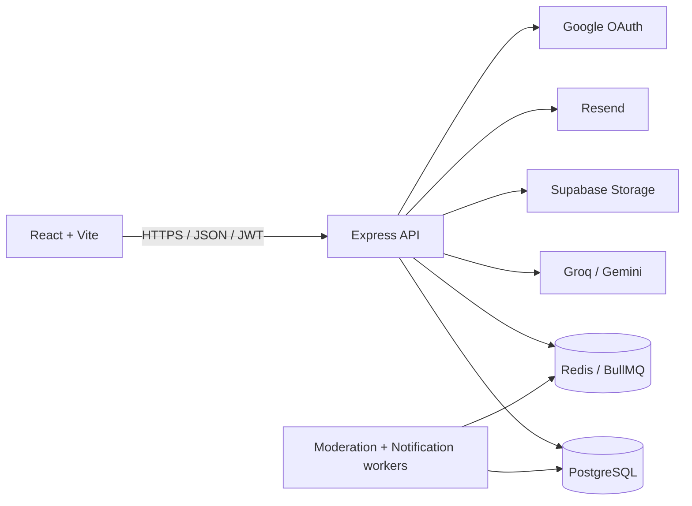
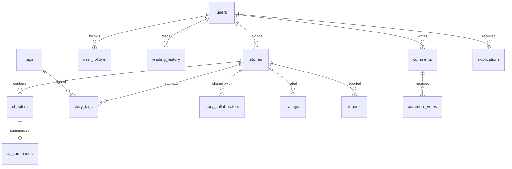
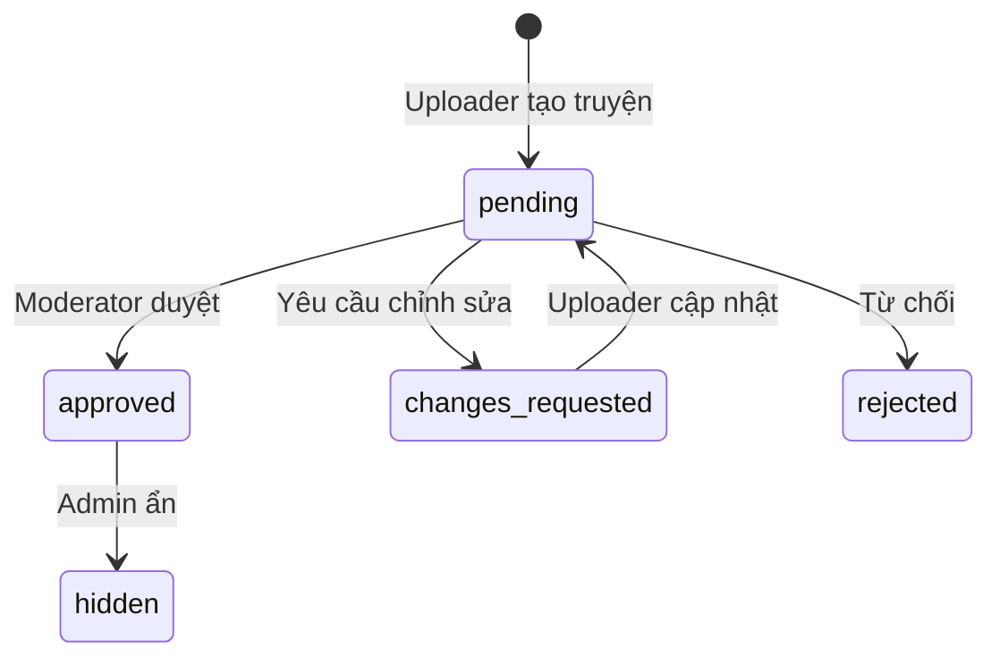

# Kiến trúc hệ thống CMC Truyện

> Tài liệu hiện hành, đồng bộ với code trong `backend/src` và `frontend/src`.

## Tổng quan

CMC Truyện sử dụng kiến trúc frontend/backend tách rời. React gọi REST API Express bằng JSON; JWT được gửi qua header `Authorization`. Backend kết nối PostgreSQL qua connection pool, Redis/BullMQ cho tác vụ nền và các dịch vụ bên ngoài cho AI, storage, OAuth và email.

## Backend

`backend/src/app.js` cấu hình security middleware, CORS, JSON parser, static uploads, health check và mount toàn bộ router dưới `/api`.

| Lớp | Trách nhiệm |
|---|---|
| `config/` | Environment, PostgreSQL pool, Redis, queue và Supabase |
| `routes/` | Định tuyến REST, authentication, authorization và upload middleware |
| `controllers/` | Validation, orchestration và HTTP response |
| `models/` | SQL query và một số Sequelize model |
| `services/` | AI, queue, email, OTP, moderation, notification và import file |
| `workers/` | Consumer BullMQ cho moderation và notification |
| `scripts/migrations/` | Migration SQL chạy theo thứ tự tên file |

Backend dùng Express 4, không phải Express 5. Truy vấn chính sử dụng `pg`; một số khu vực vẫn sử dụng Sequelize nên không nên mô tả dự án là “không dùng ORM”.

## Dữ liệu

Các nhóm bảng chính:

- Nội dung: `stories`, `chapters`, `tags`, `story_tags`, `story_collaborators`.
- Người dùng: `users`, `user_preferences`, `notification_preferences`.
- Tương tác: `reading_history`, `user_chapter_reads`, `user_follows`, `ratings`.
- Cộng đồng: `comments`, `comment_votes`, `reports`.
- Vận hành: `notifications`, `audit_logs`, `bad_words`, `ai_summaries`.

Schema cơ sở nằm tại `backend/scripts/schema.sql`. Migration tăng dần nằm tại `backend/src/scripts/migrations/` và chạy bằng `npm run db:migrate`.

## Authentication và RBAC

- JWT được xác thực bởi `authMiddleware.js`.
- `optionalAuth` cho phép endpoint công khai nhận thêm context người dùng nếu có token.
- `roleMiddleware.js` bảo vệ route theo `Admin`, `Moderator`, `Uploader`, `User`.
- Guest không phải giá trị role lưu trong database; đó là request không có phiên đăng nhập.
- Audit middleware ghi lại các mutation quản trị quan trọng và loại bỏ dữ liệu nhạy cảm.

Luồng xuất bản truyện:

Uploader chỉ được thêm/import chương khi truyện đáp ứng điều kiện workflow kiểm duyệt.

## Queue và worker

`backend/src/startWorker.js` khởi động đồng thời:

- `moderationWorker`: xử lý từ khóa và trạng thái nội dung theo tier.
- `notificationWorker`: tạo/gửi notification liên quan.

API và worker dùng chung Redis qua `REDIS_URL`. Khi phát triển tính năng queue, cần chạy worker riêng ngoài Express server.

## AI

`aiService.js` gọi Groq (`llama-3.1-8b-instant`) trước; nếu không cấu hình hoặc thất bại thì fallback sang Gemini. Request có timeout 30 giây và kết quả được cache trong RAM; tóm tắt chương còn được lưu tại `ai_summaries`.

API key chỉ tồn tại ở backend. Frontend không gọi trực tiếp nhà cung cấp AI.

## Hiệu năng

- PostgreSQL pool tái sử dụng connection.
- Index tập trung vào slug, story published, chapter number, comment status và các foreign key.
- API chi tiết truyện gom tags/collaborators trong cùng query.
- API danh sách chương không trả `content`; nội dung chỉ có ở endpoint chi tiết chương.
- Pagination được giới hạn để tránh response quá lớn.
- Frontend dùng skeleton screen và Optimistic UI có rollback.

## Triển khai

- Frontend: Vercel hoặc static hosting tương thích SPA.
- Backend API và worker: hai process Render riêng.
- PostgreSQL/Redis có thể chạy managed service hoặc Docker local.
- `render.yaml` hiện khai báo web service và worker; database/Redis được cấu hình qua environment.

Xem hướng dẫn chạy local trong [README](../../README.md) và endpoint trong [API_REFERENCE](API_REFERENCE.md).
